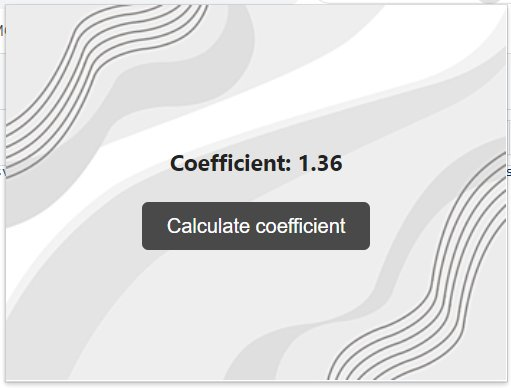

#  Random Coefficient Extension

  

## Features

Drop probability from 1.00 to 1.3 50%, probability from 1.3 to 1.5 25%, probability from 1.5 to 2.00 20%, probability from 2 to 3 4%, probability from 3 to 5 0.9% and from 5 to 10 0.1%

With each click, the delay is visual, with a loading bar of 3 seconds.

## Contribution

Suggestions and pull requests are welcomed!.

---

This project was bootstrapped with [Chrome Extension CLI](https://github.com/dutiyesh/chrome-extension-cli)

